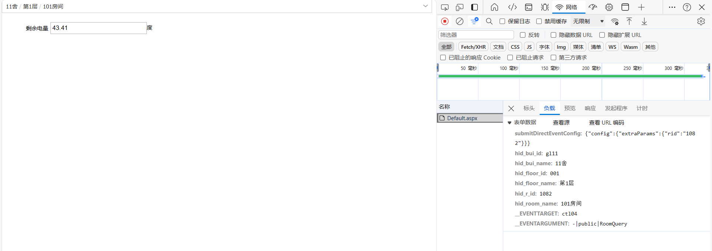
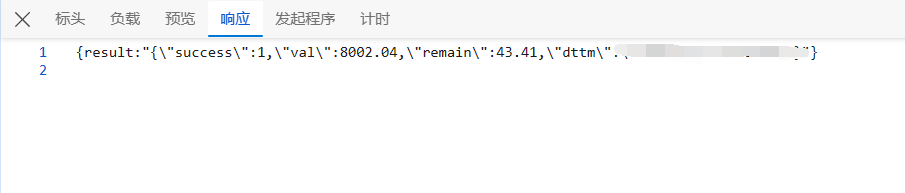

### 摘要

因为宿舍供了个小主机当服务器，为了防止没电导致服务器突然down掉，遂想办法搞了电费不足时自动发邮件提醒的脚本。脚本运行一次检测一次，用crontab来定时运行

在LUG群友的提点下搞了这个仓库

参考项目：[GeRongcun/NJU_MonitorElectricityCosts: 利用Selenium库每隔5分钟爬取学校电费查询网站的数据，检测导师办公室电费使用情况，判断导师是否来学校。 (github.com)](https://github.com/GeRongcun/NJU_MonitorElectricityCosts)


### 总体介绍

通过页面[学生宿舍用电须知 (nju.edu.cn)](https://hqjt.nju.edu.cn/dlzx/8b/d5/c1400a297941/page.htm)了解到了查询网站

通过[自助查询（鼓楼）](http://114.212.254.14:8899/query/Default.aspx)里面F12检查网络活动发现了一个算API的东西吧

这里我用南园11舍举例（如果要问我为什么是11舍，因为我是11舍黑子）



这些负载data后面就会用到

然后看看响应信息



包含我们想要的剩余电量和电量更新时间，还可以转json格式


### 整体代码

#### 获取电量与日期

```python
import requests
import json


#查询网站网址，仙林与鼓楼不同
url='http://114.212.254.14:8899/query/Default.aspx'


def getNumAndDate():
    headers = {
        'Content-Type': 'application/x-www-form-urlencoded; charset=UTF-8',
        'X-Ext-Net': 'delta=true',
        'X-Requested-With': 'XMLHttpRequest',
    }
    #这里我就随便找个11舍为例了（为了防止自己房间号被暴露）
    data = {
        'submitDirectEventConfig': '{"config":{"extraParams":{"rid":"1082"}}}',
        'hid_bui_name': '11舍',
        'hid_floor_id': '001',
        'hid_floor_name': '第1层',
        'hid_r_id': '1082',
        'hid_room_name': '101房间',
        '__EVENTTARGET': 'ctl04',
        '__EVENTARGUMENT': '-|public|RoomQuery'
    }

    response = requests.post(url=url,data=data,headers=headers)
    # print(response.text)

    #为了转json，把原本result两边加上双引号
    response_text = response.text.replace('result','"result"')

    respdata = json.loads(response_text)
    respdata = json.loads(respdata['result'])

    remainValue = respdata['remain']
    updateTime = respdata['dttm']


    # print(remainValue,updateTime)
    return remainValue,updateTime
```


#### 发送邮件

这个网上搜索就行，我随便找的一个教程[python 学习笔记（5）——SMTP 使用QQ邮箱发送邮件_pythonqq邮箱发送-CSDN博客](https://blog.csdn.net/hao_13/article/details/132818286)

```python
import smtplib
from email.mime.text import MIMEText
from email.utils import formataddr
import traceback

#发送邮箱，我的小号
mailSender = '3143180454@qq.com'
#授权码，此次我做了隐藏
authcode = 'ilovebegonia'
#接收邮箱
mailAccepter = '2239849100@qq.com'


def mail(message):
    try:
        msg = MIMEText(message, 'plain', 'utf-8')
        #发信源
        msg['From'] = formataddr(["bego", mailSender])
        #收信者
        msg['To'] = formataddr(["贝果", mailAccepter])
        #主题
        msg['Subject'] = "快没电辣"
        #调用IMAP/SMTP服务
        server = smtplib.SMTP_SSL("smtp.qq.com", 465)
        server.login(mailSender, authcode)
        #发送
        server.sendmail(mailSender, [mailAccepter, ], msg.as_string())

        server.quit()  # 关闭连接
    except Exception as e:
        print("邮件发送出现异常！")
        traceback.print_exc()
        return False
    return True
```


#### main函数

获取数据

保留日志

判断与发送消息

```python
#设置警告电量
warningNum = 30


if __name__ == "__main__":
    #运行脚本用于检测与发邮件，定时系统准备交给crontab，每天12:30和22:30准备定时任务（这个时间舍友都在宿舍也方便让他们一起充电费）
    remain, time = getNumAndDate()
    #追加方式打开
    with open('./electricityNumRecord.txt','a') as f:
        f.write(str(time)+' '+str(remain)+'kwh\n')
        f.close()

    if remain <= warningNum:
        message = f"电费不足！还剩余{remain}kwh"

        ret = mail(message)
        if ret:
            print("邮件发送成功")
        else:
            print("邮件发送失败")

    print("执行完毕")
```


### 设置定时

```bash
crontab -e
```

加入以下内容，意为每日12:30与22:30执行一次（这个时间舍友都在，方便叫着一起交电费）

```bash
30 12 * * * /usr/bin/python3 /path/to/your/script.py
30 22 * * * /usr/bin/python3 /path/to/your/script.py
```


